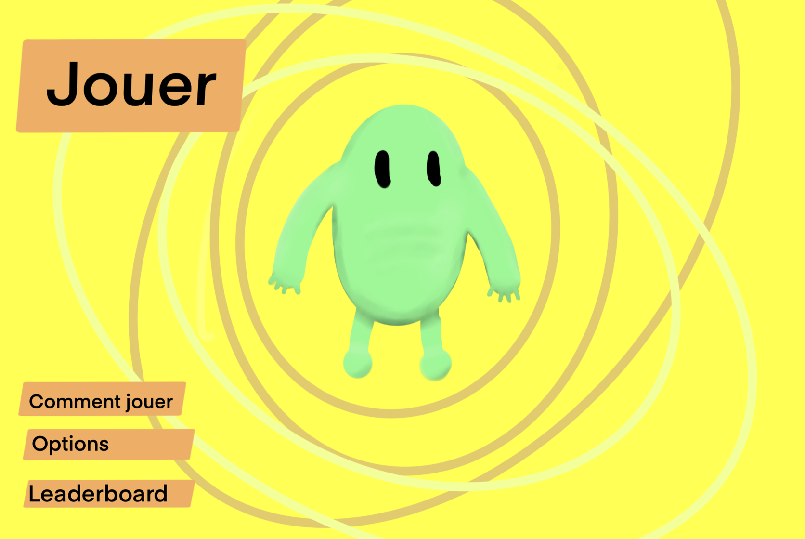
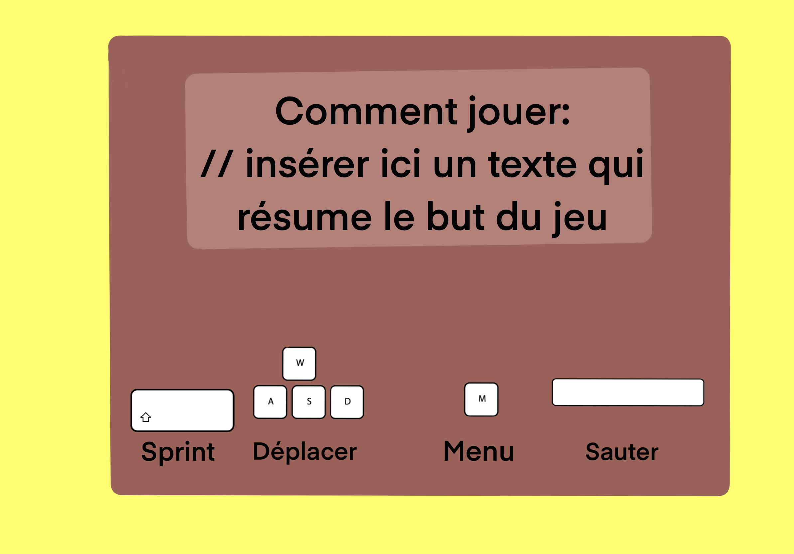
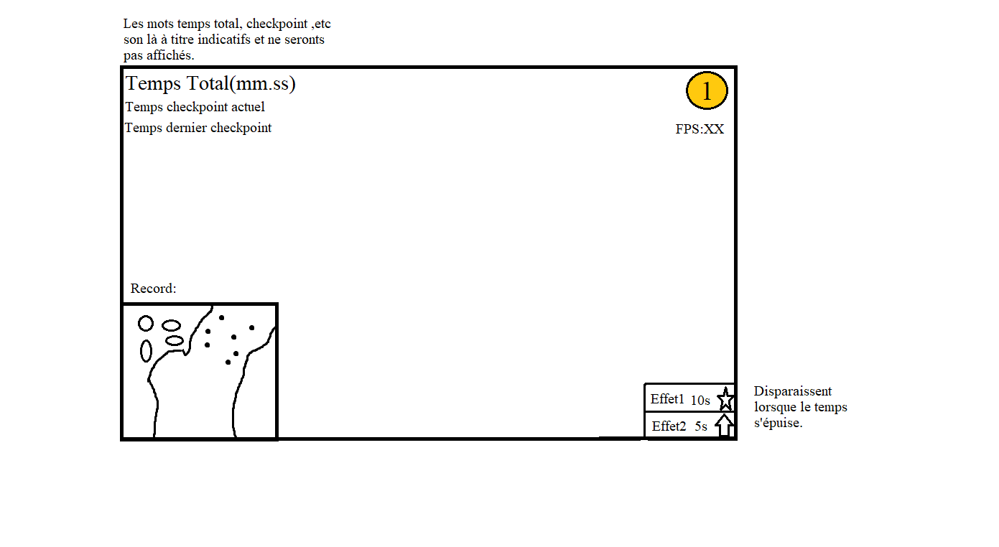

# SIM In Motion

Course parkour sur un niveau et contre la montre.

## Menus

### Menu principal

### Contrôles

### Tableau de bord

### Résultat

## Jouabilité

Interface adaptée pour toutes types de personnes voulant utiliser le programme. Très convivial à utiliser et pour plus d'amples informations à propos de la jouabilité, l'utilisateur a accès à toutes les informations sur le fonctionnement du jeu dans la section Contrôles et Comment Jouer du menu principal.

L'utilisateur utilise W,A,S et D pour déplacer le personage. La barre d'espace fait sauter le personage. La vue est à la 3eme personne et bouger la souris fait bouger la caméra.

### Exemples de sections pour la course:
* Une section de code à compléter par le joueur.
* Des calculs mentals à faire le plus rapidement possible. (4 + 3 = ?)
* Une section parkour comme on a déjà parlé.
* etc...

### Environnement

Environnement fermé très enfantin, fortement inspiré du jeu Fall Guys. 

| Élément | Type | Description |
|:---------|:-------------|:--------|
| Capsules | Adhérence Force Gravité Vitesse | Plus de friction Saut et changement de direction plus puissants Modification de la gravité globale Meilleure accélération et plus grande vitesse maximale |
| Objets | Aimant Ventilateurs | Attraction de projectile Repoussement du personnage |
| Obstacles | Pendules | Objet avec mouvement de pendule ayant pour but de pousser le joueur en bas de la plateforme |
| Plateformes | Effritables Intermittentes Mouvantes Pièges Pivotantes Trouées | Disparait quelques secondes après y avoir touché Apparaît et disparaît selon un interval de temps Fait l'aller-retour selon une trajectoire Immobilise le personnage de se déplacer pendant quelques instants Effectue une rotation selon un pivot et un interval de temps Comportant des trous par lesquels le personnage peut tomber |
| Projectiles | À éviter Rebondissants | Ramène au dernier checkpoint si atteint Immobilise le personnage pendant quelques instants si atteint |
| Surfaces | Collante Glissante | Réduit l'accélération et augmente la vitesse maximale et la décélération Réduit l'accélération et augmente la décélération  |
| Tremplin | Trempoline | Personnage propulsé selon la vitesse et l'angle de contacte |

### Intégrations

| Matière | Description |
|:---------|:-------------|
| Mathématiques | Vecteur, Matrice, Opération géométrique, Collision |
| Physique | Gravité, Pendule, Vitesse, Friction |
| Programmation | Orientée objet, Événementielle, Graphique |
| Générales | Questions théoriques |

## Exemple

L'utilisateur démarre notre programme, ensuite la scène de chargement apparaît pour charger toutes les textures nécéssaires avant le début du jeu. En suite, lorsque tout a été chargé, la scène de chargement laisse place à la scène de menu dans laquelle il y aura quatre options sous forme de bouton. La première sera le bouton "Jouer" pour démarrer la partie, le deuxième sera un bouton "Comment jouer" pour permettre à un nouvel utilisateur de comprendre le jeu avant de lancer la partie. Celui-ci comprendra les différentes touches que l'on peut utilisée ainsi que leur fonction ainsi qu'une brève description qui résume comment jouer et on y expliquera aussi les différents atouts que l'on peut avoir au cours d'une partie. Le troisième sera le bouton "Options" pour changer quelques paramètres tels qu'afficher un compteur de FPS ou encore changer le mode d'affichage pour qu'il soit en plein écran ou non et finalement il y a le bouton "Classement" où s'y retrouve les dix meilleurs temps ainsi que le nom de ce qui détiennent ces records. La quatrième sera l'option qui lui permettra de quitter le programme.

En démarrant une partie, l'utilisateur se trouvera dans le monde où se déroule la course, il y aura un compte-à-rebours de trois secondes pour permettre à l'utilisateur de se préparer ensuite la course démarrera. Durant la course, il devra essayer de faire le meilleur temps possible tout en évitant les projectiles, en franchissant les obstacles, en réussisant les quizs, sous peine de se faire rajouter des malus au niveau de son temps de parcous. Supposont que l'utilisateur n'est pas satisfait de son temps à la fin du parcours, il pourra choisir de réeffectuer le parcours, de modifier les options ou de revenir au menu principal. Si le joueur n'est pas satisfait pendant son parcours ou désire modifier les options, il n'a qu'à clicker sur le bouton options et un menu de contrôle s'ouvrira. Il aura quatre possibilités, soit il recommence la course, soit il clicke sur le menu options pour changer les paramètres qu'il désire et un bouton pour revenir à la partie et fermer le menu de contrôle ou soit il quitte la partie et revient au menu principal. Toutefois, le temps continuera à défiler. Si le joueur a réalisé un parcours incroyable qui lui permet d'obtenir une place dans le classement, à la fin de sa course, le programme demandera son nom et l'affichera dans le classement avec le temps qu'il a mis pour finir le parcours. L'utilisateur pourra recommencer le parcours autant de fois qu'il le désire dans le but de battre son record, toutefois s'il n'a plus l'envie de continuer à jouer, il peut pendant ou après la partie choisir de revenir au menu principal et ainsi il pourra quitter le programme.

Avant de quitter le programme, celui-ci enregistrera tous les records établis et les chargera à nouveau lors des la scène de chargement pour permettre aux joueurs de garder leur temps. Lorsque tout ceci est fait l'utilisateur pour quitter le programme et revenir jouer dès qu'il lui plaira.
