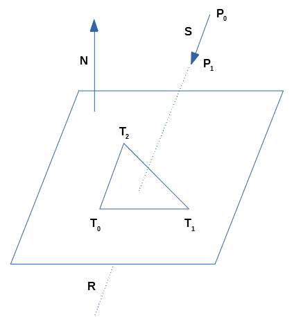
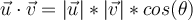
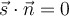
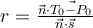
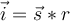

# Rayon au travers d'un plan

Sont nécessaires afin de détecter ce type de collision :
- Un segment représenté par un vecteur (S).
- Un plan représenté par un triangle (T).

Sont nécessaires afin de représenter le plan :
- Un point du plan (T0 ou T1 ou T2)
- La normale (N) du plan.

## Non parallèle

Par élimination, débutons par déterminer si le rayon (R), selon le segment (S), croise le plan.

Le produit scalaire est la multiplication des normes ainsi que du cosinus de l'angle entre deux vecteurs :

Puisque le cosinus de 90 et -90 donne 0, le segment (S) est parallèle au plan si :

## Ratio

Sachant exactement où est situé l'un des sommets du triangle (T) formant le plan et que nous tentons de déterminer à quel endroit le segment (S) croise ce plan.

Un calcul comportant une donnée commune permettrait d'obtenir un ratio du segment (S). Dans le contexte actuel, nous utiliserons la normale (N) comme donnée commune et le produit scalaire comme calcul :

- Si le ratio (r) est négatif, c'est que le segment (s) n'est pas en direction du plan.
- Si le ratio (r) est >= 0.0 et <= 1.0, c'est que le segment (s) croise le plan.
- Si le ratio (r) est > 1.0, c'est que le segment (s) croisera prochainement le plan.

## Point d'intersection

Ayant le ratio (r), il ne reste qu'à multiplier le segment (S) par le scalaire (r) afin d'obtenir la position de l'intersection (i) entre le segment (S) et le plan :

# Point dans un triangle

Une fois la position d'intersection (i) entre le segment (S) et le plan trouvée, il reste à déterminer si cette position est à l'intérieur du triangle (T) qui forme le plan.

En format deux vecteurs à partir d'un segment du triangle (T) et de la position d'intersection (i), il est possible d'utiliser le déterminant afin de connaître de quel côté la position d'intersection (i) est par rapport au segment du triangle :

- Le résultat est négatif ou positif selon le côté du segment ou se trouve la position.
- La position est sur le segment si le résultat est nul.

Si la position d'intersection (i) est du même côté de tous les segment du triangle (T), c'est donc dire qu'il est à l'intérieur du triangle.
