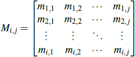
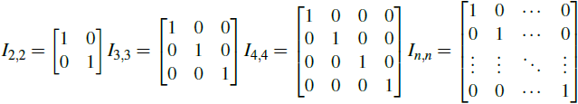
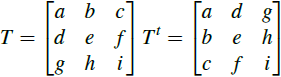
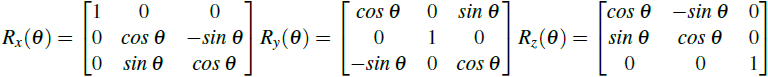
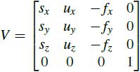

# Matrice

Une matrice est un tableau rectangulaire d’éléments ordonnés disposés sur m lignes et n colonnes, représentants la dimension de la matrice :

## Identité

Une matrice carrée dont tous les éléments de sa diagonale sont 1 et les autres 0 est appelée identité :

## Transposée

Une matrice transposée est obtenue en échangeant les lignes et les colonnes :

## Rotations

Les matrices de rotation selon les axes x, y et z sont :

## Vue

Une matrice de vue est composée des vecteurs devant, côté, et haut :

