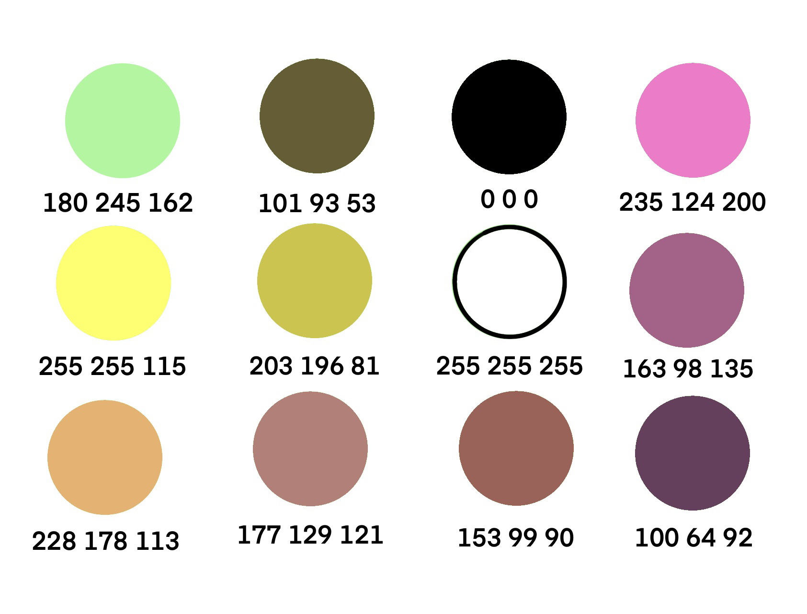

# Normes de texturisations :

## Critères de les textures :

* Taille maximum de 1800 par 
* Profondeur de 32 bits
* En format png
* 2 MB maximum pour une image
* Palette de couleur pale et claire.

Exemple de palette de couleur:

 

## Rappel :

* __Assurez vous de bien push vos textures dans le projet.__
