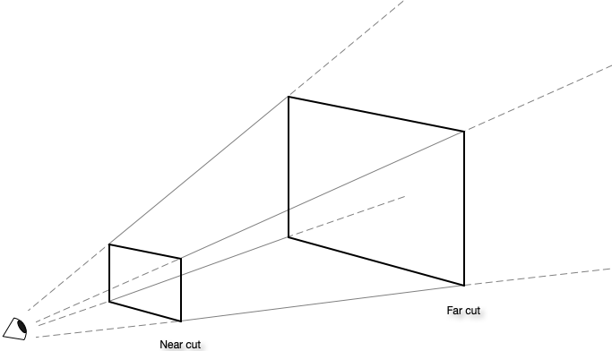
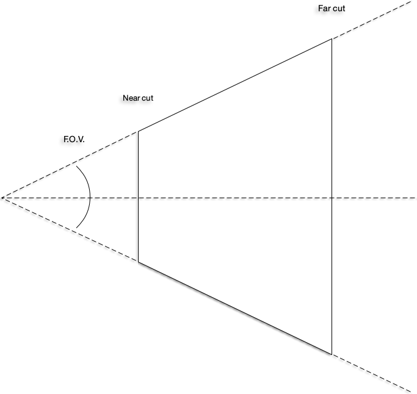

# OpenGL

« Open Graphic Library » est une librairie graphique ouverte, développée depuis 1992, permettant le développement multiplateforme dans un environnement graphique 2D et 3D.

Très largement adoptée et utilisée, cette librairie est installée par défaut et utilisée par la majorité des systèmes d'exploitation.

## Inclusions

Sous Visual Studio, les inclusions nécessaire pour utilise les librairies « SDL2 » et « OpenGL » sont :

```cpp
#pragma comment(lib, "SDL2.lib")
#pragma comment(lib, "SDL2main.lib")
#pragma comment(lib, "opengl32.lib")
#pragma comment(lib, "SDL2_ttf.lib")
#pragma comment(lib, "SDL2_image.lib")

#include <SDL2/SDL.h>
#include <SDL2/SDL_opengl.h>
#include <SDL2/SDL_ttf.h>
#include <SDL2/SDL_image.h>
```

## Processus

De façon **très** vulgarisée, la suite d'opérations (« pipeline ») qui est appliquée aux données par la librairie « OpenGL » est la suivante :

**Sommets * Matrices de transformations * Matrice de vue * Matrice de projection**

## Mode matriciel

Les sommets, les matrices de transformations et la matrice de vue seront gérés par les développeurs, tandis que l'application de la matrice de projection sera gérée par la librairie « OpenGL ». Il faut par contre déterminer cette matrice de projection.

Le mode matriciel permet d'indiquer à la librairie « OpenGL » quelle est la matrice présentement active. Toutes les instructions suivant un changement de mode matriciel s'appliqueront à la matrice indiquée :

```cpp
glMatrixMode(GL_PROJECTION);
// Instructions s'appliquant à la matrice de projection ...
glMatrixMode(GL_MODELVIEW);
// Instructions s'appliquant à la matrice d'environnement ...
```

## Projection

La perspective permet de déterminer la portion de l'environnement qui sera visible. Elle est représentée par un « frustum », qui consiste en une forme géométrique dont le sommet est tronqué. Dans le cas de la librairie « OpenGL », il s'agit d'une pyramide à base rectangulaire :



### Perspective

Puisque l'environnement est en 3 dimensions, mais qu'il doit être présenté en 2 dimensions, une matrice de projection est nécessaire afin de projeter le contenu du « frustum » sur le plan rapproché (« near cut ») :

```cpp
void glFrustum(double left, double right, double bottom, double top, double nearCut, double farCut);
```

Du dessus ou de côté, à partir de la distance du plan rapproché (« near cut »), de la distance du plan éloigné (« far cut »), et de l'angle du champ de vision (« Field Of View ») :



Il est possible de déterminer une matrice de projection :

```cpp
const double top = tan((fov / 2.0) * M_PI / 180.0) * nearCut;
const double right = (windowWidth / windowHeight) * top;
```
### Orthogonal

Si la présentation doit se faire uniquement en 2 dimensions, l'effet de profondeur n'a plus besoin d'être :

[Image Perspective vs. Orthogonal]

Donc, plutôt qu'une matrice de projection, c'est une matrice orthogonale qui sera utilisée :

```cpp
void glOrtho(double left, double right, double bottom, double top, double nearCut, double farCut);
```
