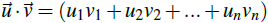

# Vecteur

Un vecteur est une donnée représentant à la fois une longueur, une direction, et un sens.

## Composantes

Un vecteur possède plusieurs composantes :

## Norme

La norme d'un vecteur représente sa longueur :

### Unitaire

Un vecteur est unitaire lorsque sa norme vaut 1 :

## Somme

La somme vectorielle consiste à mettre des vecteurs bout à bout résultant à un vecteur :

## Différence

La différence vectorielle est similaire à la somme :

## Produit scalaire

Le produit scalaire permet de calculer des équations de droites et de plans :

## Produit par un scalaire

Le produit d'un vecteur par un scalaire permet de modifier la norme du vecteur :

## Produit vectoriel

Le produit vectoriel permet d'obtenir un vecteur orthogonal à 2 vecteurs :

## Angle

Permet d'obtenir l'angle entre 2 vecteurs :

