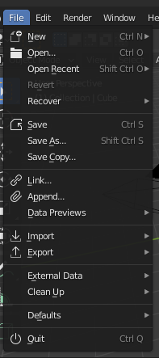
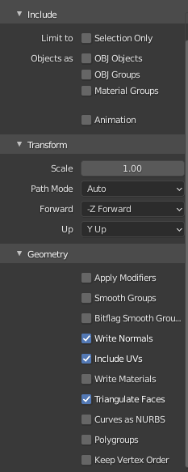

# Normes de modélisations
## Nombre maximum de sommets:
* Nous allons le déterminer plus tard.
## Étalon :
* 1 cube (par défault) dans blender équivaut à un cube de une unité dans notre jeu.
## Point (0,0,0) des modèles :
* Le point (0,0,0) se situe au centre du modèle.
## Comment exporter un modèle?
* Allez dans File/Export/Wavefront (.obj).\

* Par la suite, choisisez l'endroit où vous voulez sauvegarder le modèle.

* Finalement, Activez les presets suivants et cliquez sur "Export OBJ":\

